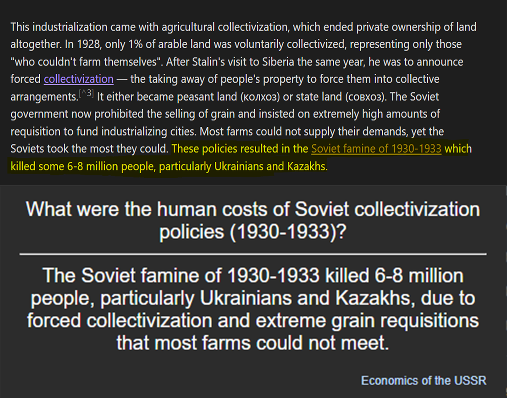

# ObsidianKi

Automated flashcard generation to Anki from your Obsidian vault.



## Setup

1. **Install dependencies:**
   ```bash
   pip install requests python-dotenv anthropic
   ```

2. **Configure Obsidian Local REST API plugin:**
   - Install [plugin](https://github.com/coddingtonbear/obsidian-local-rest-api) in Obsidian
   - Ensure it's running, then copy the API key

3. **Install AnkiConnect:**
   - Add-on code: `2055492159`
   - Keep Anki running

4. **Create `.env` file:**
   ```
   OBSIDIAN_API_KEY=your_obsidian_api_key
   ANTHROPIC_API_KEY=your_anthropic_api_key
   ```

5. **Customize configuration:** (optional)
   ```json
   {
      "MAX_CARDS": 6,
      "NOTES_TO_SAMPLE": 3,
      "DAYS_OLD": 30,
      "SAMPLING_MODE": "weighted",
      "TAG_SCHEMA_FILE": "tags.json",
      "PROCESSING_HISTORY_FILE": "processing_history.json",
      "DENSITY_BIAS_STRENGTH": 0.5,
      "SEARCH_FOLDERS": ["Research"],
      "CARD_TYPE": "custom"
   }
   ```

6. **Create `tags.json` for weighted sampling:** (optional)
   ```json
   {
     "field/history": 2.0,
     "field/math": 1.0,
     "field/science": 1.5,
     "_default": 0.5
   }
   ```

## Usage

Run periodically (or via a job): `python main.py`

**Configuration (`config.py`):**
- `MAX_CARDS = 6` - Flashcard limit per run
- `NOTES_TO_SAMPLE = 3` - Notes to process per run
- `DAYS_OLD = 30` - Only process notes older than X days
- `SAMPLING_MODE = "weighted"` - Use tag weights vs uniform sampling
- `DENSITY_BIAS_STRENGTH = 0.5` - Avoid over-processed notes (0-1)
- `CARD_TYPE = "custom"` - "basic" or "custom" (adds clickable note links)

**Generated files:**
- `processing_history.json` - Tracks flashcards created per note
- `tags.json` - Tag weights for sampling preference

## How it works

1. Finds old notes in specified folders
2. Weights notes by tags and processing history (avoids notes with too many flashcards)
3. Generates flashcards using Claude 4 Sonnet
4. Creates cards in Anki **"Obsidian"** deck

**Smart sampling:**
- Higher-weighted tags get selected more often
- Notes with fewer flashcards relative to size preferred
- Prevents exhausting small notes while allowing large notes more cards

**Card Types:**
- **Basic**: Standard front/back flashcards
- **Custom**: Includes clickable "Origin" field that opens the source note